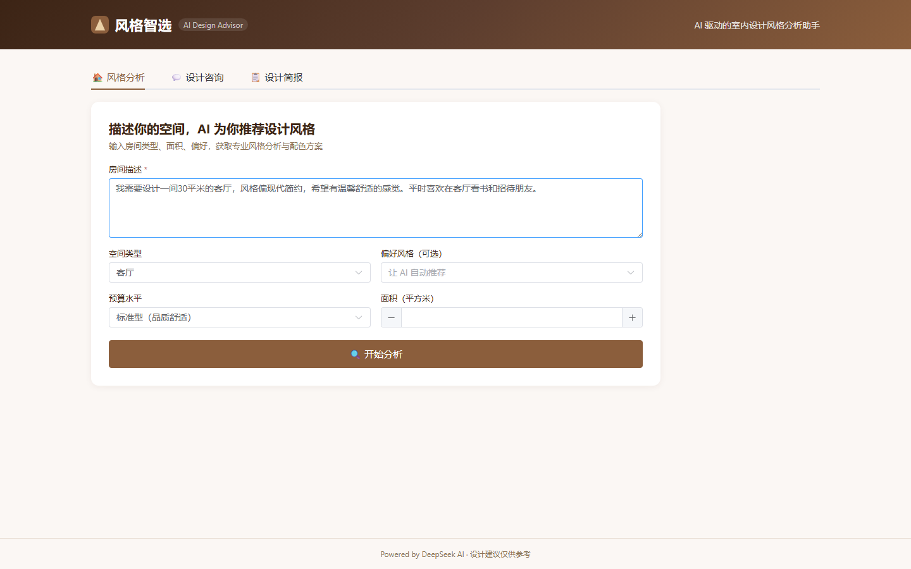
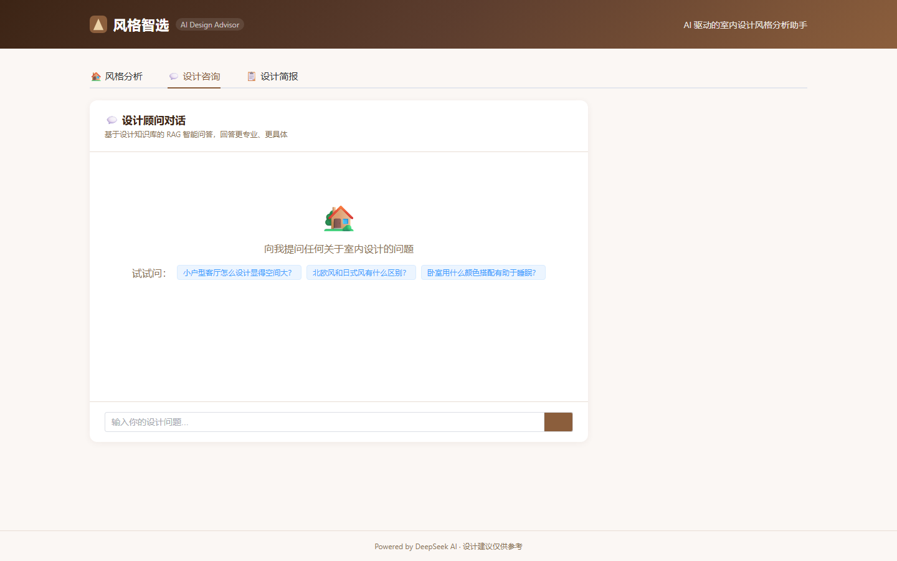

<div align="center">

# 🏠 风格智选 — AI 室内设计助手

**AI 驱动的室内设计风格分析与咨询平台**

[](https://vuejs.org/)
[](https://www.typescriptlang.org/)
[](https://vite.dev/)
[](https://spring.io/)
[](https://openjdk.org/)
[](https://platform.deepseek.com/)
[](https://en.wikipedia.org/wiki/Retrieval-augmented_generation)
[](LICENSE)

*描述你的空间需求 → AI 智能匹配设计风格 → 生成专业设计方案与咨询建议*

</div>

---

## ✨ 核心功能

| 功能 | 描述 | 技术亮点 |
|------|------|----------|
| 🏠 **AI 风格分析** | 输入房间描述、类型、面积、偏好 → AI 推荐最佳设计风格 | LLM 结构化输出 |
| 💬 **设计咨询对话** | 基于 RAG 的设计顾问，检索 15 种风格知识库精准回答 | **RAG 检索增强生成** |
| 📋 **设计简报** | 自动生成包含配色、家具、搭配建议的完整设计文档 | 可打印/导出 |
| 🎨 **备选方案** | 每次分析给出 2 个备选风格方案及匹配评分 | 多方案对比 |
| 📚 **设计知识库** | 内置 15 种设计风格的专业知识（现代简约~法式复古） | Embeddings 向量化 |

---

## 📸 项目截图

### 风格分析 — 输入页面


*暖色调设计主题 UI，输入房间描述、选择空间类型和预算偏好*

### 填写需求



*支持 11 种预设风格偏好、4 档预算水平、空间面积自定义*

### 设计咨询 — RAG 对话



*基于 RAG 检索增强的设计顾问，内置 15 种风格知识库，回答更专业具体*

### 设计简报


*基于分析结果自动生成结构化设计简报，可打印与设计师沟通*

---

## 🛠️ 技术栈

| 层级 | 技术 | 说明 |
|------|------|------|
| **前端** | Vue 3 + TypeScript + Element Plus | 暖色调设计主题 UI |
| **构建** | Vite 6.0 | 极速开发体验 |
| **后端** | Spring Boot 3.5 | Java 21 REST API |
| **ORM** | MyBatis-Plus + H2/MySQL | 自动建表 + 种子数据 |
| **AI Chat** | DeepSeek API (deepseek-chat) | LLM 对话 + 结构化 JSON 输出 |
| **AI Embedding** | DeepSeek Embeddings API | 文本向量化（4096 维） |
| **RAG 引擎** | 自研：ChunkingService + RetrievalService | 中文分块 + 余弦相似度 Top-K |
| **知识库** | 15 种设计风格内置种子数据 | 自动向量化索引 |

## 📐 系统架构

```
┌──────────────────────────────────────────────────────────┐
│                    Vue 3 前端 (Vite)                       │
│  ┌──────────────┐  ┌──────────────┐  ┌──────────────┐   │
│  │  风格分析     │  │  设计咨询     │  │  设计简报     │   │
│  │  (POST /api  │  │  (SSE /api   │  │  (本地渲染)   │   │
│  │   /analyze)  │  │   /chat)     │  │              │   │
│  └──────┬───────┘  └──────┬───────┘  └──────────────┘   │
└─────────┼─────────────────┼──────────────────────────────┘
          │                 │
          ▼                 ▼
┌──────────────────────────────────────────────────────────┐
│                Spring Boot 3.5 (Java 21)                   │
│                                                           │
│  ┌──────────────┐  ┌──────────────────────────────────┐  │
│  │ DesignService │  │        RAG 检索增强引擎           │  │
│  │  · analyze() │  │  ChunkingService → EmbeddingClient│  │
│  │  · chat()    │  │       → RetrievalService          │  │
│  └──────┬───────┘  │       → RagContextBuilder          │  │
│         │          └──────────────────────────────────┘  │
│         ▼                                                │
│  ┌──────────────────────────────────────────────────┐   │
│  │         DeepSeek API (Chat + Embeddings)          │   │
│  └──────────────────────────────────────────────────┘   │
│                                                           │
│        MyBatis-Plus ←→ H2 (dev) / MySQL (prod)           │
│        15 design styles + design_chunk vectors            │
└──────────────────────────────────────────────────────────┘
```

**RAG 对话流程：**

1. 用户提问 → `EmbeddingClient` 将问题向量化
2. `RetrievalService` 在 `design_chunk` 中余弦相似度搜索 Top-5
3. `RagContextBuilder` 将检索结果与问题拼接为增强 Prompt
4. DeepSeek Chat 基于真实设计知识生成回答
5. 回答附带引用来源（如"来源于北欧风、日式侘寂知识库"）

---

## 🗂️ 项目结构

```
design-ai-advisor/
├── backend/                              # Spring Boot 3.5 后端
│   ├── src/main/java/com/designadvisor/
│   │   ├── ai/                           # AI 服务（DeepSeek Chat + Embedding）
│   │   │   ├── AiService.java            #   AI 调用接口
│   │   │   ├── AiProperties.java         #   AI 配置属性
│   │   │   └── DeepSeekAiService.java    #   DeepSeek 实现
│   │   ├── config/                       # CORS、MyBatis-Plus 配置
│   │   ├── controller/                   # REST API（/api/analyze, /api/chat）
│   │   ├── dto/                          # 请求/响应对象
│   │   ├── entity/                       # DesignStyle、DesignChunk 实体
│   │   ├── mapper/                       # MyBatis-Plus Mapper
│   │   ├── rag/                          # 🆕 RAG 检索增强引擎
│   │   │   ├── ChunkingService.java      #   中文文本智能分块
│   │   │   ├── EmbeddingClient.java      #   Embeddings 调用封装
│   │   │   ├── RetrievalService.java     #   余弦相似度 Top-K 检索
│   │   │   ├── RagContextBuilder.java    #   RAG Prompt 构建
│   │   │   └── RagProperties.java        #   RAG 配置
│   │   └── service/                      # 业务逻辑层
│   ├── src/main/resources/
│   │   ├── application.yml               # 主配置
│   │   ├── application-dev.yml           # 开发环境（H2 + RAG）
│   │   └── schema.sql                    # 建表 + 15 风格种子数据
│   └── pom.xml
├── frontend/                             # Vue 3 + TypeScript 前端
│   ├── src/
│   │   ├── api/design.ts                 # API 调用（Axios + SSE）
│   │   ├── components/
│   │   │   ├── StyleAnalyzer.vue         # 风格分析主组件
│   │   │   ├── DesignChat.vue            # RAG 设计咨询对话
│   │   │   └── DesignBrief.vue           # 设计简报展示
│   │   ├── stores/design.ts              # Pinia 状态管理
│   │   ├── types/design.ts               # TypeScript 类型
│   │   └── views/HomeView.vue            # 主页面（3 Tab）
│   ├── vite.config.ts
│   └── package.json
├── docs/screenshots/                     # 项目截图
├── README.md
└── .gitignore
```

---

## 🚀 快速启动

### 环境要求

- Java 21+ / Maven 3.8+
- Node.js 18+
- DeepSeek API Key（[获取](https://platform.deepseek.com/api_keys)）

### 1. 启动后端

```bash
cd backend

# 设置 API Key
export DEEPSEEK_API_KEY=sk-xxxxxxxx

# 开发模式（H2 内存数据库，无需 MySQL）
mvn spring-boot:run -Dspring-boot.run.profiles=dev
```

后端运行在 **http://localhost:8080**

### 2. 启动前端

```bash
cd frontend
npm install
npm run dev
```

前端运行在 **http://localhost:5173**

### 3. 使用

1. 打开 http://localhost:5173
2. 在「风格分析」Tab 输入房间描述和偏好
3. 点击「开始分析」获取 AI 推荐
4. 切换到「设计咨询」Tab 进行 RAG 对话
5. 查看「设计简报」Tab 获取完整方案

---

## 📋 内置设计风格

| 类别 | 风格 | 特点 |
|------|------|------|
| 现代 | 现代简约、北欧风、极简主义、奶油风 | 简洁线条、功能优先 |
| 东方 | 新中式、日式侘寂、原木风 | 自然材质、意境营造 |
| 当代 | 工业风、轻奢风、Art Deco、暗黑风 | 个性表达、材质混搭 |
| 地域 | 地中海风、美式乡村、波西米亚风、法式复古 | 文化符号、浪漫氛围 |

---

## 🚢 部署

```bash
# 前端构建
cd frontend && npm run build

# 后端打包
cd backend && mvn clean package -DskipTests

# 运行
java -Dspring.profiles.active=prod \
     -DDEEPSEEK_API_KEY=sk-xxxxxxxx \
     -jar target/design-ai-advisor-1.0.0.jar
```

---

## 📄 License

MIT © 2024 [spider-freedom](https://github.com/spider-freedom)

---

<div align="center">
  <sub>Built with ❤️ for interior designers and homeowners</sub>
</div>
